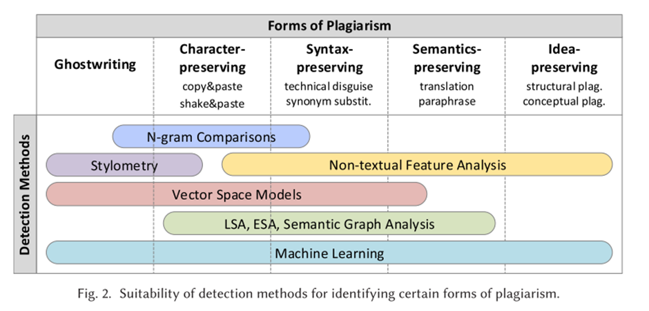

# Academic Document Plagiarism Detection using LLMs and RAG

## Overview
This repository contains the work developed for a **master’s thesis** focused on **academic document plagiarism detection** using **Large Language Models (LLMs)** and **Retrieval-Augmented Generation (RAG)** approaches, including **Graph-based RAG**.

The project investigates how modern AI techniques can be applied to detect plagiarism beyond surface-level text similarity, addressing semantic, structural, and idea-level reuse in academic writing.

---

## Research Motivation
Traditional plagiarism detection systems rely heavily on lexical and syntactic similarity, which limits their effectiveness against:
- Paraphrasing
- Structural reordering
- Semantically equivalent reformulations
- Idea-level plagiarism

Recent advances in **LLMs, embeddings, vector databases, and knowledge graphs** provide new opportunities to improve plagiarism detection by enabling deeper semantic understanding and contextual retrieval.

---

## Objectives
The main objectives of this thesis project are:
- Study and categorize **forms of academic plagiarism**, including:
  - Lexical plagiarism
  - Syntax-preserving plagiarism
  - Semantics-preserving plagiarism
  - Idea-level plagiarism
- Explore **LLM-based plagiarism detection** strategies
- Design and evaluate **RAG-based pipelines** for document comparison
- Investigate **Graph RAG** approaches to represent document structure, citations, and conceptual relationships
- Analyze strengths, limitations, and risks of LLM-based plagiarism detection


---
## Practical Steps

This project follows a 4-stage extrinsic plagiarism detection pipeline aligned with **PAN-PC-11** evaluation needs (offset-based segment detection). The core idea is: **classical semantic candidate search → bounded retrieval → LLM verification → span merging**.

### Stage A — Candidate Generation (ESA or LSA baseline)
**Goal:** For each suspicious text window, retrieve the most likely source candidates (**top-K**) from the full source corpus.

**Steps:**
1. **Chunk suspicious documents** into fixed windows (e.g., 150–250 tokens with overlap) or sentence blocks.
2. **Track character offsets** for every window: `char_start`, `char_end` (required for PAN scoring).
3. Compute a vector representation for each suspicious window:
   - **ESA**: concept vector per window
   - **LSA baseline**: TF-IDF → SVD projection per window
4. Search the indexed source corpus and return **top-K** candidate source documents/passages with similarity scores.
5. Persist Stage A results for traceability and debugging:
   - suspicious window id + offsets
   - candidate source ids (doc/passages) + scores
   - (optional) top terms/concepts used by ESA/LSA

**Where to use the Vector DB:**  
- Store **source passages** as vectors + metadata (`doc_id`, `passage_id`, `char_start`, `char_end`) to support fast top-K retrieval.

---

### Stage B — Filtered Retrieval inside Top-K (Bounded RAG)
**Goal:** Retrieve the best evidence passages **only inside Stage A’s top-K candidates** (avoid a second global search).

**Steps:**
1. Take the **top-K candidates** produced in Stage A.
2. Restrict retrieval to those candidates:
   - If Stage A returns **passages**, fetch them directly.
   - If Stage A returns **documents**, retrieve top-N passages **within those documents** (BM25 or vector similarity).
3. Build an **evidence pack** containing:
   - suspicious window text + offsets
   - top-N source passages (text + offsets + doc ids)

**Where to use the Vector DB:**  
- Apply metadata filtering (e.g., `doc_id IN topK`) so retrieval is constrained to Stage A candidates.

---

### Stage C — LLM Verification (Offsets + Evidence)
**Goal:** Use an LLM to confirm plagiarism and output **offset-aligned evidence**, grounded only in retrieved text.

**Steps:**
1. Send the suspicious window + evidence pack to the LLM with a strict output schema (JSON).
2. Require the LLM to output:
   - `verdict`: `CONFIRMED` or `NOT_CONFIRMED`
   - `best_source_doc_id`
   - suspicious span offsets: `start/end`
   - source span offsets: `start/end`
   - 1–3 short **evidence quotes** (must be exact substrings of provided text)
   - confidence score + reason label (e.g., near-copy, paraphrase)
3. Automatically validate the LLM output:
   - offsets must fall within provided passage bounds
   - evidence quotes must exist verbatim in the input context
   - reject ungrounded answers (no evidence → `NOT_CONFIRMED`)

**When to trigger the LLM:**  
- Only for suspicious windows above a similarity threshold OR within top-K candidates (keeps cost + noise down).

---

### Stage D — Merge Spans for PAN Scoring (Postprocessing)
**Goal:** Reduce fragmented detections and improve PAN-style scoring by merging compatible spans.

**Steps:**
1. Sort all `CONFIRMED` detections by suspicious offsets.
2. Merge adjacent/overlapping detections when:
   - they refer to the same `source_doc_id` (or same source cluster)
   - the gap between suspicious spans is below a threshold (e.g., 200–500 characters)
   - confidence remains above a minimum threshold after merging
3. Drop detections below a minimum length (tiny segments tend to inflate false positives and fragmentation).
4. Export final detections in a PAN-friendly format (offsets + source ids).

---

<br>



---

## Methodological Focus
The project explores multiple complementary approaches:
- Text embeddings and similarity search
- Vector databases for scalable document retrieval
- RAG pipelines combining retrieval and generation
- Graph-based representations of documents (sections, citations, concepts)
- LLM reasoning over retrieved evidence

The emphasis is on **research, experimentation, and evaluation**, not on building a production-grade plagiarism detection system.

---

## Project Status
✅ **Pipeline complete — evaluated on the full PAN 2011 subset**

The end-to-end pipeline (retrieval → LLM confirmation → span merging → PAN-style
evaluation) has been built and run over the full processed corpus of 308 suspicious
documents (156 plagiarised, 152 clean).

**Headline result (308-doc run, plagiarised docs only):**

| Metric | Value |
|--------|-------|
| Macro plagdet | **0.328** |
| Macro F1 | 0.333 |
| Macro precision | 0.310 |
| Macro recall | 0.397 |
| Granularity | 1.015 |

Per-obfuscation, the system is strongest on coherent synonym-swap paraphrase
(plagdet **0.615**) — the academically most dangerous class — and weakest on
word-salad/high obfuscation (plagdet 0.334), which marks the local-hardware ceiling.
See `scripts/final/pipeline_results/old_results/` for the full experiment log and
per-run results.

Remaining work:
- Custom mini-corpus evaluation (hand-authored plagiarised samples over thesis references)
- Streamlit demo application

---

## Tech Stack
- **Python 3.12**
- **pandas** – data processing and analysis
- **requests** – data acquisition and API interaction
- **Streamlit** – interactive experimentation and visualization
- **LLMs** – for semantic analysis and reasoning
- **RAG / Graph RAG** – retrieval and structured context modeling
- **Vector DB** – DB for vector storing (chroma db as it is open source)
- **uv** – dependency and environment management

---

## Environment Setup
This project uses **uv** for Python environment and dependency management.

```bash
# Install dependencies from lockfile
uv sync
```


```bash
# Download preffered embedding models
uv run hf  download Qwen/Qwen3-Embedding-0.6B --local-dir artifacts/embeddings/Qwen3-Embedding-0.6B
```

---

## Final Pipeline — PAN 2011 Batch Runner

The production pipeline is implemented in `scripts/final/run_pipeline.py`. It processes suspicious documents end-to-end: source retrieval → LLM confirmation → span merging → ground-truth evaluation.

### Running the pipeline

```bash
# Single document (fastest — good for testing)
python scripts/final/run_pipeline.py --doc-id part1__suspicious-document00001.txt --skip-tfidf

# First N documents, no TF-IDF (recommended for batch runs)
python scripts/final/run_pipeline.py --docs 20 --skip-tfidf

# Full run with all branches
python scripts/final/run_pipeline.py

# Skip LLM entirely — retrieval metrics only
python scripts/final/run_pipeline.py --docs 50 --skip-tfidf --skip-llm

# Wipe resume cache and reprocess everything
python scripts/final/run_pipeline.py --fresh
```

### Key parameters

| Flag | Default | Effect |
|------|---------|--------|
| `--docs N` | all | Process only the first N suspicious documents |
| `--doc-id` | — | Process a single specific document ID |
| `--skip-tfidf` | off | Skip TF-IDF branch (recommended — 60–70% faster, minimal recall loss) |
| `--skip-esa` | off | Skip ESA branch (use if RAM < 24 GB) |
| `--skip-llm` | off | Skip LLM confirmation — retrieval evaluation only |
| `--top-n` | 20 | Candidates passed from retrieval to LLM |
| `--relative-gap` | 0.70 | Keep candidates scoring ≥ top1_score × this value before LLM |
| `--llm-threshold` | 0.85 | Min LLM score to confirm a source document |
| `--fresh` | off | Ignore per-doc resume cache |

### Understanding the output

#### Per-document line
```
[GT]  gt_spans=6  detected=1  TP=1  FP=0  FN=0  P=1.00  R=1.00  F1=1.00  charP=0.92  charR=1.00  charF1=0.96
```

| Field | Meaning |
|-------|---------|
| `gt_spans` | Number of ground-truth plagiarism spans from the PAN 2011 XML annotation. Each span is one plagiarised passage with exact character offsets. A single suspicious doc can have multiple GT spans from different source docs. |
| `detected` | Number of spans the pipeline produced after LLM confirmation + span merging. Adjacent confirmed chunks within `MAX_GAP` chars are merged into one span, so `detected` is often much lower than `gt_spans`. |
| `TP` | Detected spans that overlap at least one GT span **from the correct source doc**. Binary — touching any part of a GT span counts. |
| `FP` | Detected spans with no GT overlap, or pointing to the wrong source doc. These are false alarms. |
| `FN` | GT spans not covered by any detected span. Missed plagiarism. Note: if merging absorbs multiple GT spans into one detected span, all those GT spans are covered (FN=0 for them) even though `detected < gt_spans`. |
| `P` | Binary precision = TP / (TP + FP) |
| `R` | Binary recall = TP / (TP + FN) |
| `F1` | Binary F1 = harmonic mean of P and R |
| `charP` | Char precision = overlap_chars / detected_chars. Penalises spans that are too wide — if a detected span covers 10k chars but only 2k overlap GT, charP=0.20. |
| `charR` | Char recall = overlap_chars / gt_chars. Penalises missing chars — if GT has 10k plagiarised chars but only 5k were detected, charR=0.50. |
| `charF1` | Char-level F1 — the most honest single metric, balances span width against coverage. |

**Why gt_spans=6 but detected=1 can still give F1=1.00:**
The 6 GT spans may all be on the suspicious-doc side close together (e.g. a short 13-chunk doc that is almost entirely plagiarised). The merge step (gap ≤ 1800 chars) fuses all confirmed chunks into 1 big span that covers all 6 GT regions. Binary metrics only ask "did you touch any GT span?" — 1 merged span touching all 6 = TP=1, FN=0, F1=1.00. Character metrics then show the real picture: charP=0.92 means the merged span is slightly wider than needed.

**Why multiple LLM-confirmed sources can result in 0 FP:**
If the LLM confirms 4 sources but only 1 is correct, the span merging deduplication step (`drop_duplicates` by suspicious chunk, keeping highest embedding score) assigns each suspicious chunk to its best-matching source. If the correct source dominates all chunk-level embedding scores, the wrong confirmed sources lose their chunks and produce no detected spans — 0 FP despite 3 wrong LLM confirmations. This is a natural self-correction mechanism.

**Why two sets of metrics?** Binary metrics only ask "did you touch any GT span?" — they give F1=1.0 even if your detected span is 10× larger than the GT. Character-level metrics penalise over-merged spans, giving a more honest picture of detection granularity.

#### Special cases for clean documents (gt_spans = 0)

| Situation | P | R | F1 | Meaning |
|-----------|---|---|----|---------|
| gt_spans=0, detected=0 | 1.0 | 1.0 | 1.0 | Correct silence — pipeline correctly found nothing |
| gt_spans=0, detected>0 | 0.0 | 1.0 | 0.0 | False alarm — LLM confirmed a source on a clean document |
| gt_spans>0, detected=0 | 1.0 | 0.0 | 0.0 | Missed — true source not retrieved or not confirmed by LLM |

**Note on same-author false alarms:** PAN 2011 includes source docs from the same books/authors as clean suspicious docs (e.g. different volumes of the same diary). These share genuine verbatim text but are not plagiarism in the PAN sense. The LLM may confirm these, producing FP on clean docs. This is a known dataset-level limitation.

#### Retrieval line
```
[RET] recall_at_20=1.00  true_sources=1  hits=1
```

| Field | Meaning |
|-------|---------|
| `recall_at_20` | 1.0 = true source was in the top-20 retrieved candidates; 0.0 = missed at retrieval stage. This is a **ceiling metric** — if 0.0, the LLM stage cannot recover the miss regardless of prompt quality. |
| `true_sources` | Number of distinct source documents in the GT for this suspicious doc |
| `hits` | How many of those source docs appeared in the top-20 |

**recall_at_20=1.00 with F1=0.00** means retrieval worked but LLM rejected the correct source — a prompt/threshold problem. **recall_at_20=0.00 with F1=0.00** means retrieval failed entirely — the source was never found, no prompt change can fix it.

#### Aggregate results block

```
Metric                   Binary (macro)   Char micro   Char macro
Precision                        0.9200       0.8800       0.9100
Recall                           0.8500       0.9700       0.8600
F1                               0.8800       0.9200       0.8800
```

| Column | Meaning |
|--------|---------|
| **Binary (macro)** | Average binary P/R/F1 across all documents (each doc weighted equally). Best for comparing runs — reflects per-document detection quality. |
| **Char micro** | Global char P/R/F1 pooled across all documents. Large docs dominate — a single 500k-char doc swamps 10 small docs. Less useful for per-doc comparison. |
| **Char macro** | Average char P/R/F1 across all documents (each doc weighted equally). Balances span precision across the corpus. |

Use **binary macro F1** as the primary metric for comparing pipeline runs. Use **char macro F1** as a secondary metric to check span quality. Char micro is reported for completeness but is dominated by large docs.

```
Clean docs with false alarms: 3 / 150
```
How many clean (non-plagiarised) documents triggered a false alarm — LLM confirmed a source when none existed. Ideally 0. A non-zero value here inflates FP counts and drags down macro precision.

### Output files

All results are written to `scripts/final/pipeline_results/`:

| File | Contents |
|------|----------|
| `per_doc/<doc_id>.parquet` | Detected spans for each document (one row per merged span) |
| `analytics_summary.parquet` | One row per document with all P/R/F1 metrics |
| `retrieval_recall.parquet` | Retrieval recall@K per document |

### Computing the official PAN plagdet score

`run_pipeline.py` writes the raw detections and analytics; the official PAN 2011
**plagdet** metric (F1 / log₂(1 + granularity)) is computed separately by
`scripts/final/compute_plagdet.py`, which reads the saved parquet files — it does
**not** re-run the pipeline, so it is fast and re-runnable.

```bash
# Score the current pipeline_results/
uv run python scripts/final/compute_plagdet.py

# Score an archived run
uv run python scripts/final/compute_plagdet.py \
    --analytics scripts/final/pipeline_results/old_results/308_docs_full_v3/analytics_summary.parquet \
    --out-dir   scripts/final/pipeline_results/old_results/308_docs_full_v3
```

| Flag | Effect |
|------|--------|
| `--analytics PATH` | Which `analytics_summary.parquet` to score |
| `--per-doc-dir PATH` | Directory of per-doc span parquets (default `pipeline_results/per_doc/`) |
| `--out-dir PATH` | Where to write `plagdet_summary.parquet` + `obfuscation_breakdown.parquet` |
| `--extended` | Use `_extended.parquet` (char n-gram aligner output) where present |

It prints macro/micro plagdet, precision, recall, granularity (over plagiarised
docs), and a per-obfuscation breakdown. Plagiarised docs with zero detections count
as precision=0.0 (a missed source is a failure, not perfect precision), so the macro
is not inflated by misses.

### Pipeline stages explained

```
Suspicious document
       │
       ▼
[Stage 1] Source Retrieval
  — ESA: Corpus TF-IDF concept space (100k features, unigrams+bigrams)
  — LSA: Latent semantic space (SVD)
  — Embeddings: Qwen3-0.6B dense vectors via FAISS (GPU)
  — TF-IDF: Character n-gram sparse vectors (disabled by default — very slow)
  → Fused: final_score = 0.20×weighted_mean + 0.80×weighted_max
  → Gate 1: skip doc if top1_score < 0.60 (no credible source found)
  → Gate 2: keep candidates ≥ top1_score × 0.85
  → Branch union: top-3 from each branch added regardless of fusion score
    (prevents a correct source found by one branch being buried by others)
       │
       ▼
[Stage 2] LLM Confirmation (gemma4:26b MoE via Ollama)
  — Top-25 chunk pairs per candidate sent to LLM
  — Rubric prompt v3, discrete score bands (0.00/0.25/0.50/0.85/0.95/1.00)
  — LLM scores 0–1: likelihood this is the true source
  — Threshold 0.85: only high-confidence sources kept
  — (optional) GPT-2 perplexity pre-filter caps word-salad pairs at 0.25
       │
       ▼
[Stage 3] Span Merging
  — Deduplicate: one best match per suspicious chunk
  — Merge adjacent spans with gap ≤ 1800 chars (same source doc)
       │
       ▼
[Stage 4] Evaluation
  — Binary span P/R/F1
  — Character-level P/R/F1
  — Compare against PAN 2011 XML ground truth
```

### Hardware requirements

| Component | Minimum | Development machine |
|-----------|---------|---------------------|
| RAM | 16 GB (ESA disabled) | 32 GB DDR5 |
| GPU VRAM | 3 GB (embeddings + LLM sequential) | 16 GB (RX 7900 GRE, ROCm) |
| CPU | Any modern x86-64 | i5-13600KF |
| Storage | ~50 GB for PAN 2011 processed artefacts | NVMe SSD |

If RAM < 24 GB, use `--skip-esa`. If no GPU, the embedding branch will be slow but functional on CPU.

