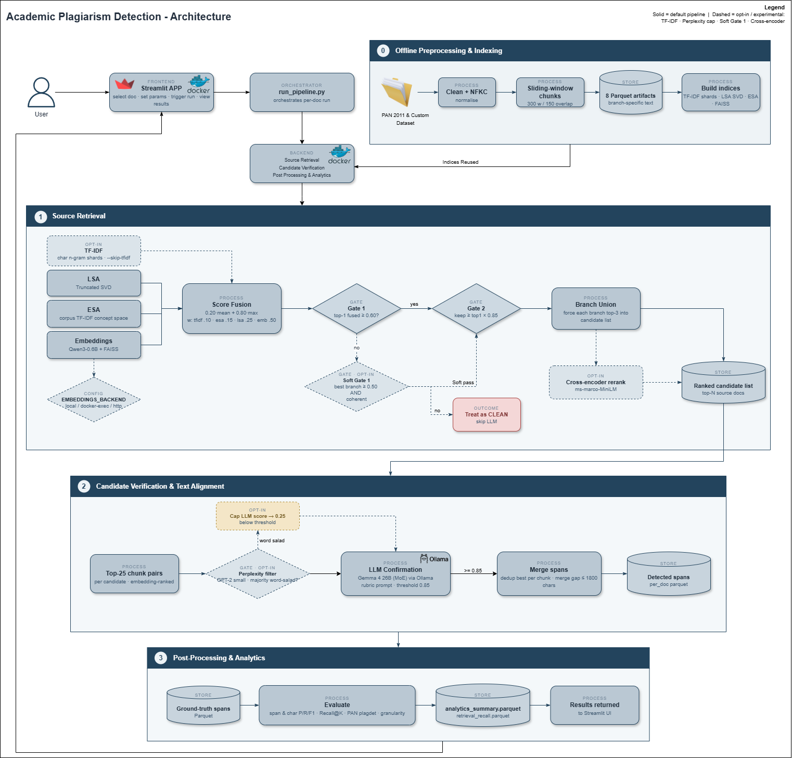

# Academic Document Plagiarism Detection with Retrieval and LLM Confirmation

This repository contains the implementation developed for a master's thesis on
academic document plagiarism detection. The final system is an extrinsic
plagiarism-detection pipeline: it receives suspicious documents, retrieves likely
source documents, asks a local LLM to confirm source alignment, merges detected
spans, and evaluates the result against ground-truth annotations.

The project is primarily a research artifact, not a production service. It is
designed to make experiments reproducible on a single GPU workstation while
keeping enough instrumentation to explain why a document was detected, missed, or
rejected.


*Forms of plagiarism and the suitability of detection methods. This system
targets the character-, syntax-, and semantics-preserving forms via the
combination of vector-space models (TF-IDF), LSA/ESA, and embedding-based
retrieval, followed by LLM confirmation.*

## Final Status

The thesis implementation is complete.

- PAN 2011 subset evaluation was completed on 308 suspicious documents.
- A custom curated dataset was added for robustness checks.
- The Streamlit UI can launch single-document or batch runs.
- The retrieval pipeline supports ESA, LSA, optional TF-IDF, and Qwen/FAISS
  embeddings.
- The LLM confirmation stage uses Ollama, with `gemma4:26b` as the final model.
- The system can run locally from the CLI or through Docker Compose.
- Streamlit-triggered runs are saved to local run logs for debugging.

## Architecture



*End-to-end architecture: offline preprocessing and indexing, source retrieval
with fusion and gating, LLM candidate verification, and span extraction. Solid
boxes are the default path; dashed boxes are opt-in / experimental stages.*

The system is a two-stage extrinsic plagiarism detection pipeline. A suspicious
document is received through the Streamlit interface and compared against a
reference collection of source documents (PAN-PC-11 as the primary benchmark, or
a custom curated collection of 30 source academic papers). The architecture
avoids exhaustive pairwise document comparison by filtering candidates
progressively through a retrieval stage and a two-gate filter before any
expensive LLM inference is performed.

**Document Preparation and Indexing (offline, one-time).** Source documents are
cleaned, split into overlapping word-window chunks, and enriched with document
identifiers, chunk identifiers, and character offsets, then stored as Parquet.
Indexing builds the branch-specific structures reused across all queries:
compressed sparse NumPy shards (TF-IDF), a fitted vectorizer plus SVD model (LSA),
a sparse TF-IDF matrix (ESA), and a FAISS vector index (embeddings).

**Plagiarism Detection Process (per suspicious document).** The suspicious
document is preprocessed identically, queried against each retrieval branch, and
each branch's chunk-level similarities are aggregated to the document level by
taking the maximum score across chunk pairs. The embedding branch runs on GPU
through a dedicated embedding service; the other branches run on CPU. The four
branch scores are combined with a weighted fusion formula into a single ranked
candidate list. A two-gate filter then decides which candidates reach the LLM:
Gate 1 is an absolute floor on the top-1 fusion score (below it the document is
treated as clean and the LLM stage is skipped), and Gate 2 keeps only candidates
within a relative gap of the top-1 score. In addition, the top candidates of each
individual branch are guaranteed a place in the forwarded set (branch union), so
a source found by only one branch is not lost to fusion averaging.

**Candidate Verification and Span Extraction.** The forwarded candidates are read
by the LLM (`gemma4:26b` via Ollama, using a discrete plagiarism-likelihood
rubric), which produces a structured verdict. Confirmed candidates are mapped back
to character-level spans using the preserved chunk offsets, and adjacent spans are
merged when the gap between them is below a configurable threshold, producing
clean non-fragmented detections. Results are returned to the Streamlit interface
and, for PAN-PC-11, scored against the ground-truth XML annotations with the
official plagdet metric.

```text
Offline: source docs -> clean -> chunk -> Parquet
                              -> build indices (TF-IDF | LSA | ESA | FAISS)  [reused]

Suspicious document
       |
       v
Source retrieval
  - ESA
  - LSA
  - optional TF-IDF
  - Qwen3 embeddings + FAISS (GPU service)
       |
       v
Candidate fusion and gating
  - weighted fusion (0.20 * mean + 0.80 * max)
  - Gate 1 minimum top-1 score
  - Gate 2 relative-gap filtering
  - branch-union recovery
  - optional: soft Gate 1, cross-encoder rerank
       |
       v
LLM source confirmation
  - Ollama
  - gemma4:26b
  - discrete plagiarism rubric
  - optional: GPT-2 perplexity cap (word-salad -> 0.25)
       |
       v
Span merging and evaluation
  - per-document metrics
  - retrieval recall
  - PAN-style plagdet summaries
```

An editable, all-in-one diagram of the full pipeline and the containerized
deployment topology is available in `Architecture_poster.drawio` (open with
[draw.io](https://app.diagrams.net/)). Solid boxes are the default path; dashed
boxes are opt-in / experimental stages.

## Repository Layout

| Path | Purpose |
|------|---------|
| `scripts/final/run_pipeline.py` | Main end-to-end pipeline runner |
| `scripts/final/04_source_retrieval/source_retrieval_branches.py` | Retrieval branches, fusion, and embedding backend selection |
| `scripts/embeddings.py` | Qwen embedding lookup and FAISS retrieval |
| `scripts/embedding_service.py` | HTTP wrapper used by the Docker embeddings service |
| `scripts/final/07_streamlit_app/app.py` | Streamlit UI and subprocess runner |
| `docker-compose.yml` | Multi-service deployment for Ollama, embeddings, Streamlit, and optional batch pipeline |
| `docker_files/` | Dockerfiles and ROCm helper scripts |
| `datasets/` | Local datasets and processed parquet artifacts, mostly ignored by Git |
| `artifacts/` | Local models, indexes, and generated artifacts, ignored by Git |
| `scripts/final/pipeline_results*/` | Evaluation outputs, debug dumps, and run logs |

## Requirements

Core environment:

- Python 3.12
- `uv`
- Docker Desktop or Docker Engine
- Ollama, either native on the host or through Compose

Development hardware used:

- AMD GPU through ROCm on WSL2
- `rocm/pytorch:latest` for the embedding service
- `ollama/ollama:rocm` for the LLM service

The Docker Compose GPU settings are intentionally tuned for AMD ROCm on WSL2:

- `/dev/dxg`
- `/usr/lib/wsl/lib/libdxcore.so`
- `/opt/rocm/lib/librocdxg.so`
- `HSA_ENABLE_DXG_DETECTION=1`

Linux-native ROCm or NVIDIA deployments will need adjusted GPU passthrough.

## Setup

Install Python dependencies:

```bash
uv sync
```

## Local Data and Artifact Layout

Required datasets, generated indexes, model weights, and run outputs are not
stored in Git. A fresh clone should create the local-only folders below before
running the pipeline:

```bash
mkdir -p datasets/PAN2011
mkdir -p datasets/PAN2025
mkdir -p datasets/processed
mkdir -p datasets/custom_dataset
mkdir -p artifacts/models
mkdir -p artifacts/embeddings
mkdir -p artifacts/embeddings_custom
mkdir -p scripts/final/pipeline_results
mkdir -p scripts/final/pipeline_results_custom
```

On Windows PowerShell, the equivalent is:

```powershell
New-Item -ItemType Directory -Force `
  datasets/PAN2011, `
  datasets/PAN2025, `
  datasets/processed, `
  datasets/custom_dataset, `
  artifacts/models, `
  artifacts/embeddings, `
  artifacts/embeddings_custom, `
  scripts/final/pipeline_results, `
  scripts/final/pipeline_results_custom
```

Place or generate the required data as follows:

| Folder | What to put there | Required for |
|--------|-------------------|--------------|
| `datasets/PAN2011/` | Raw PAN 2011 corpus files, if rebuilding preprocessing from scratch | PAN 2011 preprocessing |
| `datasets/processed/PAN2011_300/` | Processed PAN chunks and source/suspicious parquet files | PAN 2011 pipeline runs |
| `datasets/processed/custom_300/` | Processed custom-dataset chunks and retrieval inputs | Custom pipeline runs |
| `datasets/processed/custom_ground_truth/` | Custom ground-truth parquet generated from XML annotations | Custom evaluation |
| `datasets/custom_dataset/` | Lightweight custom dataset docs, annotations, and README material | Custom dataset rebuilds |
| `artifacts/models/Qwen3-Embedding-0.6B/` | Local Hugging Face embedding model directory | Live embedding lookup |
| `artifacts/embeddings/` | PAN 2011 FAISS embedding indexes and metadata | PAN 2011 embedding retrieval |
| `artifacts/embeddings_custom/` | Custom-dataset FAISS embedding indexes and metadata | Custom embedding retrieval |
| `artifacts/esa*`, `artifacts/lsa*`, `artifacts/tfidf*` | ESA, LSA, and TF-IDF indexes built by the index-creation scripts | Retrieval branches |
| `scripts/final/pipeline_results/` | PAN 2011 run outputs | PAN 2011 results |
| `scripts/final/pipeline_results_custom/` | Custom dataset run outputs | Custom results |

The embedding model can be downloaded with:

```bash
uv run hf download Qwen/Qwen3-Embedding-0.6B \
  --local-dir artifacts/models/Qwen3-Embedding-0.6B
```

For the final pipeline to run without rebuilding indexes, the important local
directories are:

```text
datasets/processed/PAN2011_300/
datasets/processed/custom_300/
datasets/processed/custom_ground_truth/
artifacts/models/Qwen3-Embedding-0.6B/
artifacts/embeddings/
artifacts/embeddings_custom/
artifacts/esa*/
artifacts/lsa*/
```

These folders are intentionally ignored because they contain large downloaded,
generated, or machine-specific files. The repository stores the code and
documentation, not the local experiment payloads.

## Running Locally

Use the local CLI when debugging the algorithm or reproducing a known experiment.

Example known-good custom document run:

```bash
uv run python scripts/final/run_pipeline.py \
  --dataset custom \
  --doc-id suspicious-document00007.txt \
  --skip-tfidf \
  --retrieval-recall-k 5 \
  --run-embeddings \
  --relative-gap 0.85 \
  --debug-llm \
  --fresh \
  --ollama-model gemma4:26b
```

Useful local flags:

| Flag | Meaning |
|------|---------|
| `--dataset pan2011` / `--dataset custom` | Select corpus |
| `--doc-id ID` | Process one suspicious document |
| `--docs N` | Process first N documents |
| `--fresh` | Ignore cached per-document results |
| `--skip-tfidf` | Skip the slow TF-IDF branch |
| `--skip-esa` | Skip ESA if memory is tight |
| `--skip-llm` | Retrieval-only run |
| `--run-embeddings` | Force live embedding lookup |
| `--embeddings-backend local` | Run `scripts/embeddings.py` directly |
| `--embeddings-backend http` | Use the embedding HTTP service |
| `--ollama-model gemma4:26b` | Select Ollama model |
| `--debug-llm` | Save LLM prompts/debug JSON |

For local Ollama, start the Ollama desktop/app or run:

```bash
ollama serve
ollama pull gemma4:26b
```

## Running with Docker Compose

The default Compose stack starts:

- `ollama`
- `ollama-models`
- `embeddings`
- `streamlit`

It does not auto-run the batch pipeline. Pipeline execution is triggered from the
Streamlit UI.

From WSL, run:

```bash
docker compose up --build
```

Then open:

```text
http://localhost:8501
```

The `ollama-models` one-shot service checks whether `gemma4:26b` exists in the
Compose Ollama volume and pulls it if missing. Normal `docker compose down` does
not delete this volume. `docker compose down -v` does delete it and will force a
model re-download.

Run only the optional batch pipeline profile:

```bash
docker compose --profile pipeline up pipeline
```

Recreate Streamlit after changing Compose settings:

```bash
docker compose up -d --force-recreate streamlit
```

The Compose file bind-mounts `./scripts` into the containers, so edits to pipeline
code are visible without rebuilding the image.

## Streamlit UI

The Streamlit app is intended for quick single-document experiments and small
batches. It exposes:

- dataset selection
- selected document or batch mode
- retrieval parameters
- LLM model and threshold
- embedding backend
- fresh/cache mode
- LLM debug prompt dumping

The UI launches `scripts/final/run_pipeline.py` as a subprocess with the selected
parameters. It writes a timestamped log for every run.

Run logs are saved under:

```text
scripts/final/pipeline_results/run_logs/
scripts/final/pipeline_results_custom/run_logs/
```

These logs include:

- exact command
- `OLLAMA_HOST`
- `OLLAMA_TIMEOUT_SECONDS`
- `EMBEDDINGS_BACKEND`
- `EMBEDDINGS_URL`
- combined stdout/stderr

## Important Runtime Notes

Inside Docker, `localhost` is not the host or a sibling container. The pipeline
therefore uses:

```text
OLLAMA_HOST=http://ollama:11434
EMBEDDINGS_URL=http://embeddings:8000
```

For local CLI runs, `OLLAMA_HOST` is normally left unset so the Ollama Python
package uses the local default.

LLM confirmation can be slow. `gemma4:26b` may take several minutes per candidate
source document, especially with many chunk pairs. The runner now prints live
progress:

```text
[LLM] Scoring 4 candidate source docs with Ollama...
[LLM] (1/4) scoring source-document00016.txt with 25 chunk pair(s)...
[LLM] (1/4) done source-document00016.txt: score=0.950 likely=True t=190.2s
```

The default LLM request timeout is controlled by:

```text
OLLAMA_TIMEOUT_SECONDS=600
```

## Troubleshooting

Port 11434 is already in use:

```bash
# Stop native Ollama, or change the Compose port mapping.
docker compose up -d ollama
```

Ollama model missing inside Compose:

```bash
docker compose exec ollama ollama pull gemma4:26b
docker compose exec ollama ollama list
```

Check whether the LLM is loaded/running:

```bash
docker compose logs -f ollama
docker compose exec ollama ollama ps
```

Embedding service health:

```bash
curl http://localhost:8000/health
```

If embedding ROCm fails inside Docker but works in WSL, run Compose from WSL and
confirm the WSL ROCm library paths exist:

```bash
ls -l /usr/lib/wsl/lib/libdxcore.so
ls -l /opt/rocm/lib/librocdxg.so
```

## Outputs

Pipeline outputs are written to:

```text
scripts/final/pipeline_results/
scripts/final/pipeline_results_custom/
```

Important files:

| File | Meaning |
|------|---------|
| `analytics_summary.parquet` | Per-document precision/recall/F1 |
| `retrieval_recall.parquet` | Retrieval recall@K |
| `per_doc/<doc_id>.parquet` | Final detected spans |
| `llm_debug/<doc_id>/*.json` | Saved LLM prompts when `--debug-llm` is enabled |
| `run_logs/*.log` | Streamlit-launched run logs |

Most generated outputs are ignored by Git. Keep only compact summaries or
hand-curated result snapshots when they are needed for the thesis narrative.

## Human Comparison Examples

The [`human_comparison_examples/`](human_comparison_examples/) folder contains
side-by-side samples of suspicious vs. source passages that the pipeline
**confirmed as plagiarism** in the final PAN 2011 run. Each example shows the
highest-similarity chunk pair the LLM was given, with the matching phrases in
**bold**, so a human reviewer can quickly judge whether the detection is correct.
The set spans both low-obfuscation (near-verbatim synonym swaps) and
high-obfuscation (heavy paraphrase) cases. Start with the folder's
[README](human_comparison_examples/README.md) for the index and a short
reading guide.

## Thesis Documents

The thesis write-up covers the implementation and the discussion of results. The
document files themselves are kept outside version control and are not part of
this repository.

## Pull Request Hygiene

Before opening a PR to `main`, check:

```bash
git status --short
```

Expected code/config/docs files for the final containerized version include:

```text
README.md
.gitignore
.dockerignore
docker-compose.yml
docker_files/
requirements.txt
scripts/embedding_service.py
scripts/embeddings.py
scripts/final/run_pipeline.py
scripts/final/04_source_retrieval/source_retrieval_branches.py
scripts/final/07_streamlit_app/app.py
scripts/requirements-rocm.txt
```

Do not commit:

```text
artifacts/
datasets/processed/
datasets/PAN2011/
datasets/custom_dataset/source_documents/
datasets/custom_dataset/suspicious_documents_pdf/
scripts/final/pipeline_results*/per_doc/
scripts/final/pipeline_results*/llm_debug/
scripts/final/pipeline_results*/run_logs/
*.parquet
*.docx
*.7z
.venv/
.uv-cache/
```

The repository should contain the implementation and documentation, not the large
local datasets, model weights, transient logs, or generated thesis exports.
